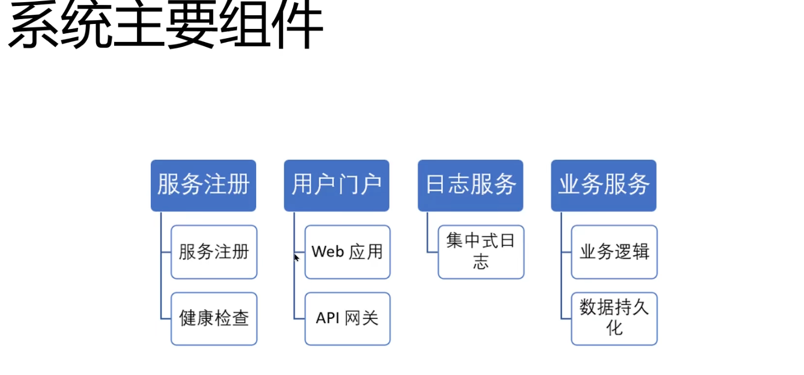
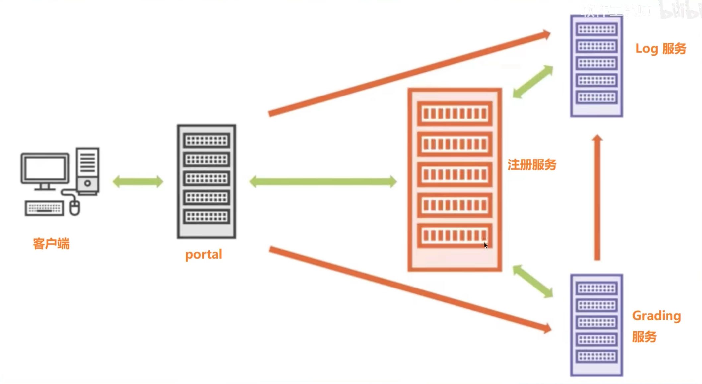

### 分布式系统
1. 模型选择
    * Hub&Spoke 主从模式 负载均价可以
    * p2p 没有单点故障
    * 消息队列 模型
    * 混合模型
2. 
3. 
4. 微服务
    * 服务注册add
    * 服务删除remove
    * 服务发现（一个服务请求另外一个服务）--注册中心告诉服务依赖的服务的url
    * 当所依赖的服务有变化（停止了或者新增了）需要告知被依赖的服务
    * 服务状态监控

### TODO
1. `ctx,cancel:=context.WithCancel(ctx)`这个第一次用 去了解一下
